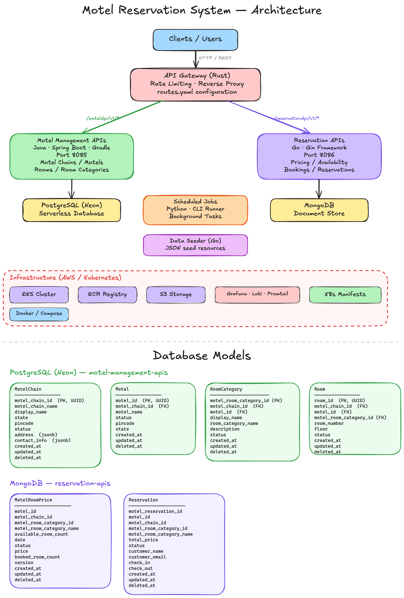
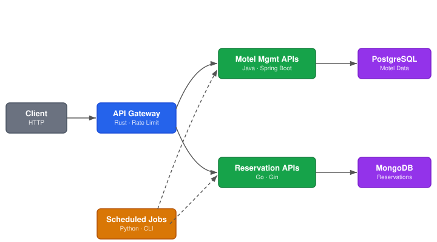

# Motel Reservation System (Practice Project)

> A **microservices-based motel booking platform** built purely for learning system design, API design, and cloud-native deployment patterns. Inspired by *System Design Interview* (book) and AI-assisted *Vibe Coding*.

---

## 🚀 Project Overview

| # | Capability | Status |
|---|-----------|--------|
| 1 | Onboard motel chains & add room inventory | ✅ Done |
| 2 | Search motels by location | ✅ Done |
| 3 | View room availability & pricing | ✅ Done |
| 4 | Book motel rooms (check-in / check-out) | ✅ Done |
| 5 | Price publishing scheduled job | ✅ Done |
| 6 | API Gateway with rate limiting | ✅ Done |
| 7 | Kubernetes deployment on EKS | ✅ Done |
| 8 | Observability (Grafana · Loki · Promtail) | ✅ Done |
| 9 | Payments & ledger | 🔲 Planned |
| 10 | API authentication strategies | 🔲 Planned |

---

## 🏗️ Architecture

The system follows a **microservices architecture** with an API Gateway fronting two backend services, backed by separate databases, and supported by scheduled jobs and a data seeder.

| Layer | Component | Description |
|-------|-----------|-------------|
| **Entry** | API Gateway (Rust) | Reverse proxy, route-based dispatch, rate limiting |
| **Service** | Motel Management APIs (Java) | CRUD for chains, motels, rooms, categories |
| **Service** | Reservation APIs (Go) | Pricing, availability, bookings, reservations |
| **Worker** | Scheduled Jobs (Python) | Background tasks (e.g. price publishing) |
| **Tooling** | Data Seeder (Go) | Seeds motel data from JSON resources |
| **Data** | PostgreSQL (Neon) | Relational store for motel entities |
| **Data** | MongoDB | Document store for prices & reservations |
| **Infra** | AWS EKS / K8s | Cluster orchestration & service deployment |
| **Infra** | AWS ECR | Container image registry |
| **Infra** | AWS S3 | Object storage (Loki logs) |
| **Observability** | Grafana · Loki · Promtail | Metrics dashboards & log aggregation |

---

## 🛠️ Tech Stack

| Category | Technology | Version / Details |
|----------|-----------|-------------------|
| Language | Java | 17 (toolchain) |
| Language | Go | 1.24.5 |
| Language | Rust | 2021 edition |
| Language | Python | 3.x |
| Framework | Spring Boot | 3.5.3 |
| Framework | Gin | 1.10.1 |
| Framework | Tokio + Hyper | 1.34 / 0.14.27 |
| Database | PostgreSQL | Neon (serverless) |
| Database | MongoDB | 1.17.4 driver |
| Build | Gradle | 8.x (Spring dep-mgmt 1.1.7) |
| Build | Cargo | Rust package manager |
| Container | Docker / Compose | Per-service Dockerfile + compose |
| Orchestration | Kubernetes (EKS) | Deployments, Services, Namespaces |
| Registry | AWS ECR | `update-ecr.sh` per service |
| Monitoring | Grafana + Loki + Promtail | Helm-based install on EKS |
| Storage | AWS S3 | Log storage for Loki |
| Testing | JUnit 5 + Mockito + H2 | Java unit & integration tests |

---

## 📂 Repository Structure

| Directory | Purpose |
|-----------|---------|
| `motel-api-gateway/` | Rust API Gateway — rate limiting, reverse proxy |
| `motel-management-apis/` | Java/Spring Boot — motel CRUD service |
| `reservation-apis/` | Go/Gin — reservation & pricing service |
| `scheduled-jobs/` | Python — CLI-based background job runner |
| `archive-code/seeder/` | Go — data seeder with JSON resources |
| `infrastructure/compute/cluster/` | EKS cluster scripts (create, IRSA, monitoring) |
| `infrastructure/kubernetes/components/` | K8s manifests (deployments, services, DB pods) |
| `infrastructure/storage/` | S3 bucket setup |
| `design-docs/excalidraw/` | Excalidraw architecture diagrams |
| `design-docs/doc-images/` | Exported PNG diagrams |

---

## � API Endpoints

### Motel Management APIs — `Java · Spring Boot · Port 8085`

| Method | Endpoint | Description |
|--------|----------|-------------|
| `GET` | `/motelApi/v1/motelChains` | List all motel chains (paginated) |
| `GET` | `/motelApi/v1/motelChains/{id}` | Get a motel chain by ID |
| `POST` | `/motelApi/v1/motelChains` | Create a motel chain |
| `PUT` | `/motelApi/v1/motelChains/{id}` | Update a motel chain |
| `DELETE` | `/motelApi/v1/motelChains/{id}` | Delete a motel chain |
| `GET` | `/motelApi/v1/motels` | List all motels (paginated) |
| `POST` | `/motelApi/v1/motels` | Create a motel |
| `GET` | `/motelApi/v1/motelRoomCategories` | List room categories |
| `GET` | `/motelApi/v1/motelRoomCategories/{id}` | Get a room category |
| `POST` | `/motelApi/v1/motelRoomCategories` | Create a room category |
| `PUT` | `/motelApi/v1/motelRoomCategories/{id}` | Update a room category |
| `DELETE` | `/motelApi/v1/motelRoomCategories/{id}` | Delete a room category |
| `GET` | `/motelApi/v1/motelRooms` | List rooms (paginated) |
| `GET` | `/motelApi/v1/motelRooms/{id}` | Get a room by ID |
| `POST` | `/motelApi/v1/motelRooms` | Create a room |
| `PUT` | `/motelApi/v1/motelRooms/{id}` | Update a room |
| `DELETE` | `/motelApi/v1/motelRooms/{id}` | Delete a room |
| `GET` | `/motelApi/v1/allMotels` | Aggregated view of all motels |
| `GET` | `/motelApi/v1/allMotels/count` | Count of all motels |
| `GET` | `/motelApi/v1/ping` | Health check |

### Reservation APIs — `Go · Gin · Port 8086`

| Method | Endpoint | Description |
|--------|----------|-------------|
| `GET` | `/reservationApi/v1/priceList` | Get room price list |
| `POST` | `/reservationApi/v1/priceList` | Publish room prices |
| `GET` | `/reservationApi/v1/availableMotels` | Search available motels |
| `GET` | `/reservationApi/v1/getAllReservations` | List all reservations |
| `GET` | `/reservationApi/v1/reservation` | Get a specific reservation |
| `POST` | `/reservationApi/v1/reservation` | Create a reservation |
| `GET` | `/reservationApi/v1/allbookings` | List all bookings |
| `GET` | `/reservationApi/v1/allMotels` | Get all motels (read-through) |
| `GET` | `/reservationApi/v1/debugPrices` | Debug motel prices |
| `GET` | `/reservationApi/v1/ping` | Health check |
| `GET` | `/reservationApi/v1/health` | Health check |

---

## 🗄️ Database Models

### PostgreSQL (Neon) — `motel-management-apis`

| Table | Key Columns | Notes |
|-------|------------|-------|
| **MotelChain** | `motel_chain_id` (PK, UUID), `motel_chain_name`, `display_name`, `state`, `pincode`, `status`, `address` (jsonb), `contact_info` (jsonb) | Top-level entity |
| **Motel** | `motel_id` (PK, UUID), `motel_chain_id` (FK), `motel_name`, `status`, `pincode`, `state` | Belongs to a chain |
| **RoomCategory** | `motel_room_category_id` (PK, UUID), `motel_chain_id` (FK), `motel_id` (FK), `display_name`, `room_category_name`, `description`, `status` | e.g. Standard, Deluxe |
| **Room** | `room_id` (PK, UUID), `motel_chain_id` (FK), `motel_id` (FK), `motel_room_category_id` (FK), `room_number`, `floor`, `status` | Individual room unit |

> All tables include `created_at`, `updated_at`, `deleted_at` timestamps.

### MongoDB — `reservation-apis`

| Collection | Key Fields | Notes |
|------------|-----------|-------|
| **MotelRoomPrice** | `motel_id`, `motel_chain_id`, `motel_room_category_id`, `motel_room_category_name`, `available_room_count`, `date`, `price`, `booked_room_count`, `status`, `version` | Per-category per-date pricing |
| **Reservation** | `motel_reservation_id`, `motel_id`, `motel_chain_id`, `motel_room_category_id`, `motel_room_category_name`, `total_price`, `customer_name`, `customer_email`, `check_in`, `check_out`, `status` | Customer booking record |

> All collections include `created_at`, `updated_at`, `deleted_at` timestamps.

---

## ⚙️ API Gateway

| Feature | Detail |
|---------|--------|
| Language | Rust (Tokio + Hyper) |
| Config | `config/routes.yaml` |
| Routing | Path-based dispatch to upstream services |
| Rate Limiting | Per-route configurable (default: 10,000 req) |
| Concurrency | Thread-safe via `DashMap` |

**Route mapping:**

| Path Prefix | Upstream Service | Port |
|------------|-----------------|------|
| `/motelApi/v1/*` | `motel-management-apis` | 8085 |
| `/reservationApi/v1/*` | `reservation-apis` | 8086 |

---

## 🕐 Scheduled Jobs

| Job Name | File | Description |
|----------|------|-------------|
| `price_publisher` | `app/jobs/price_publisher.py` | Publishes room pricing data |

Jobs are run via CLI: `python -m app.cli --job <name>` or by setting `JOB_NAME` env var. The framework uses a decorator-based registry (`@register_job`).

---

## ☸️ Kubernetes & Infrastructure

| Component | Script / File | Purpose |
|-----------|--------------|---------|
| EKS Cluster | `create-cluster.sh` | Provisions the K8s cluster |
| IRSA | `enable-irsa.sh` | IAM Roles for Service Accounts |
| EBS | `permissions-ebs.sh` | Storage class permissions |
| Monitoring | `install-monitoring.sh` | Prometheus + Grafana Helm install |
| Loki | `loki-install.sh` + `loki-values.tmpl.yaml` | Log aggregation backend |
| Promtail | `promtail-install.sh` + `promtail-values.tmpl.yaml` | Log shipping agent |
| Namespace | `motel-namespace.yaml` | Dedicated `motel` namespace |
| Deployments | `infrastructure/kubernetes/components/` | Pod specs for all services + DBs |

**K8s Manifests:**

| Manifest | Deploys |
|----------|---------|
| `motel-api-gateway.yaml` | API Gateway pod + service |
| `motel-management-apis.yaml` | Java service pod + service |
| `reservation-apis.yaml` | Go service pod + service |
| `postgress.yaml` | PostgreSQL pod + service |
| `mongo.yaml` | MongoDB pod + service |

---

## 🐳 Docker

Each service has its own `Dockerfile` and `docker-compose.yml` for local development.

| Service | Dockerfile | Compose | Notes |
|---------|-----------|---------|-------|
| `motel-api-gateway` | ✅ | ✅ | Rust multi-stage build |
| `motel-management-apis` | ✅ | ✅ | Java + PostgreSQL |
| `reservation-apis` | ✅ | ✅ | Go + MongoDB |
| `scheduled-jobs` | ✅ | — | Python slim image |

---

## 🧪 Testing

| Service | Framework | Scope |
|---------|-----------|-------|
| `motel-management-apis` | JUnit 5 + Mockito + AssertJ | Unit tests (service layer) |
| `motel-management-apis` | H2 in-memory DB | Integration tests |

---

## 📌 Project Goals

| Goal | Description |
|------|-------------|
| System Design | Practice principles from *System Design Interview* |
| API Design | RESTful patterns, pagination, filtering |
| Microservices | Polyglot services with independent data stores |
| Cloud-Native | Docker → ECR → EKS pipeline |
| Observability | Grafana dashboards, centralized logging |
| Automation | Seeder scripts, scheduled jobs, infrastructure-as-code |

---

## 📚 Learning Sources

| Source | Type |
|--------|------|
| *System Design Interview* | Book |
| AI-assisted Vibe Coding | Development methodology |

---

## ❗ Disclaimer

This is a **practice project only**. It is not meant for production or commercial deployment. All work is intended to reinforce personal learning in backend systems and architecture.

---

## 📬 Contributions & Feedback

While this project is educational, feedback or suggestions to enhance learning and code quality are always welcome.

